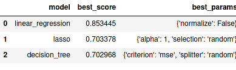

# Real Estate Prediction

Technology and tools used :
   
    1. Python
    2. Sklearn,Pandas,Numpy For Data Cleaning
    3. Matplotlib For Data Visualization
    4. ML Algorithms such as Linear Regression,Lasso Regression,Decision Tree.
    5. Finding Best Model Using GridsearchCV
    7. Exporting the Coefficients and data to pickle file & json file.
    6. Python flask for http server
    7. HTML/CSS/Javascript for UI.
    8. Deployed on AWS EC2 Instance

Final Result : 
  Best Model: Linear Regression
  
  
  
Live Website :
  http://ec2-18-191-247-3.us-east-2.compute.amazonaws.com/
